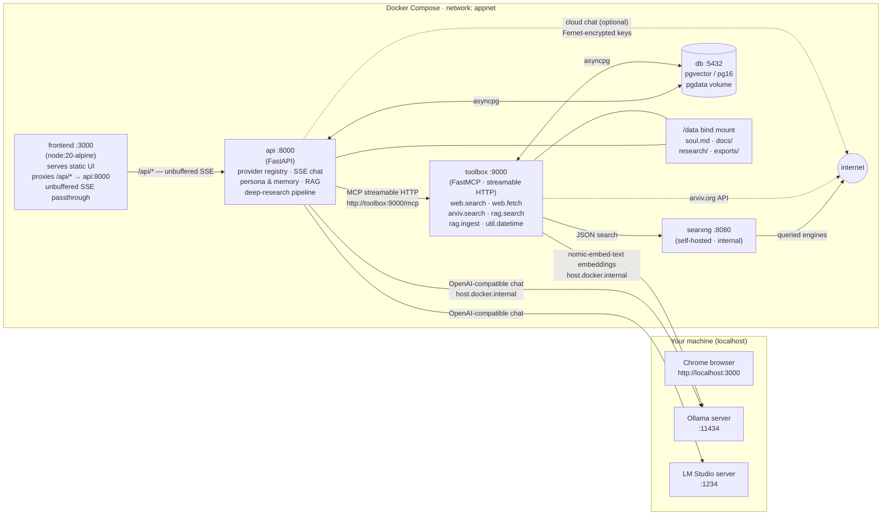

# Indus Agent

> Working name in the UI/code: **Local AI Hub**

A self-hosted, local-first AI chat hub, fully Dockerized. It auto-detects local LLM servers on your machine (Ollama / LM Studio), streams chat over SSE, and persists everything in Postgres + pgvector. Add cloud providers (OpenRouter, OpenAI, Groq, Together) whenever you want — keys are Fernet-encrypted at rest. The assistant has a memory, can search the web, read your documents, and write cited deep-research reports. Nothing leaves your machine unless you connect a cloud provider.

```
Everything local, one OpenAI-compatible wire protocol, one docker compose up.
```


▶ **[Watch the demo](https://www.youtube.com/watch?v=9SUnNx6sCxo)**

## Features

- **Local provider detection** — auto-discovers Ollama and LM Studio on the host (fast parallel probe, cached); add/remove custom OpenAI-compatible endpoints, including authenticated ones (e.g. Unsloth Desktop) with an optional encrypted API key.
- **Streaming chat** — token-by-token SSE streaming through the Node proxy, visible reasoning stream, stop-generation.
- **Persistent history** — conversations and messages survive restarts in Postgres.
- **Cloud providers** — OpenRouter / OpenAI / Groq / Together presets, validate-before-save, encrypted API keys, per-reply cost, free-model chips, pinned favorites.
- **Persona & memory** — `soul.md` persona file (hot-reloaded), async fact extraction, semantic memory with token budget.
- **MCP toolbox** — a dedicated FastMCP (streamable HTTP) server with tools for web search (self-hosted SearXNG), page fetching, arXiv, RAG, and more. Tools are toggleable per-chat.
- **Document RAG** — upload PDF/MD/TXT files; chunked, embedded with Ollama `nomic-embed-text`, stored in pgvector, cited automatically in replies.
- **Deep research** — plan → search → read → reflect → write → verify pipelines that produce cited markdown reports (quick / standard / deep presets).
- **Zero-dependency frontend** — vanilla JS, no build step, Bloomberg-terminal-style UI with a keyboard-driven F-key bar.
- **Dataset export** — download all conversations as JSONL (ShareGPT format) for fine-tuning (e.g. Unsloth): `── DATASET ──` in F11 Settings, with tool-chat exclusion and a minimum-turn filter.

## Architecture



| Service | Image | Published port | Purpose |
|---------|-------|:---:|---------|
| `frontend` | `node:20-alpine` (custom) | `127.0.0.1:3000` | Static UI + `/api` proxy (unbuffered SSE) |
| `api` | `python:3.12-slim` (custom) | `127.0.0.1:8000` | Application core (FastAPI) |
| `toolbox` | `python:3.12-slim` (custom) | — (internal) | FastMCP tool server (streamable HTTP) |
| `searxng` | `searxng/searxng` | — (internal) | Self-hosted web search |
| `db` | `pgvector/pgvector:pg16` | — (internal) | Relational + vector storage |

Only `3000` and `8000` are published in production — both bound to `127.0.0.1` (localhost-only). `toolbox`'s `9000` is published in dev mode only (`compose.dev.yaml`), for the MCP Inspector.

## Tech stack

| Layer | Tech |
|-------|------|
| Frontend | Vanilla JS / CSS (token system), Node 20 static server + SSE proxy |
| Backend | Python 3.12, FastAPI, asyncpg, SSE event streaming |
| Tools | FastMCP (streamable HTTP), SearXNG, trafilatura, arXiv API |
| Storage | Postgres 16 + pgvector (`pgdata` volume) + `./data` bind mount |
| Embeddings | Ollama `nomic-embed-text` (768-dim) |

## Quickstart

### 1. Clone and configure

```bash
git clone https://github.com/shrey160/Indus_Agent.git
cd Indus_Agent
cp .env.example .env
```

Fill in `.env` (never commit it):

```bash
DB_PASSWORD=<strong random string>      # Postgres password
SECRET_KEY=<generated below>            # Fernet key — encrypts cloud API keys
SEARXNG_SECRET=<another random string>  # Search engine instance secret
```

Generate the secrets:

```bash
python -c "import base64, os; print(base64.urlsafe_b64encode(os.urandom(32)).decode())"
```

`TEST_OPENROUTER_KEY`, `OPENROUTER_ENDPOINT`, and `ALLOWED_MODEL_OPENROUTER` are optional (test tooling) — leave them empty.

### 2. Build and run

```bash
docker compose up --build -d
```

### 3. Verify

```bash
curl localhost:8000/health      # {"status":"ok"}
curl localhost:8000/api/info    # app + db status
```

Open **http://localhost:3000** in Chrome.

### 4. Stop

```bash
docker compose down             # keeps the pgdata volume
docker compose down -v          # ⚠ wipes the database — never without intent
```

## Connecting local LLMs (Ollama / LM Studio)

Containers reach LLM servers on the host via `host.docker.internal`. Both Ollama and LM Studio bind to `127.0.0.1` by default, which containers **cannot** reach — bind them to `0.0.0.0`:

- **Windows/macOS (Docker Desktop):** `host.docker.internal` works out of the box.
  - Ollama: set the system environment variable `OLLAMA_HOST=0.0.0.0`, then restart Ollama.
  - LM Studio: Server tab → enable "Serve on local network".
- **Linux:** compose already adds `host-gateway`.
  - Ollama: `systemctl edit ollama` → `[Service]` with `Environment="OLLAMA_HOST=0.0.0.0"` → `systemctl restart ollama`.

> **Warning:** binding `0.0.0.0` exposes the LLM server to your LAN. Restrict with a firewall if unwanted.

### Authenticated local servers (e.g. Unsloth Desktop)

Some local OpenAI-compatible servers require an API key. Unsloth Desktop, for example, runs on `http://127.0.0.1:8888/v1` and returns `401` without a key:

1. Open **Providers** → `[ + ADD PROVIDER ]` → keep **`(•) Local endpoint`**.
2. Enter a name (e.g. `Unsloth Desktop`), the URL or port (`8888`, or `http://127.0.0.1:8888/v1`), and type `openai`.
3. Paste the key into the optional **API key** field → `[ SAVE ]`. The key is validated before saving and stored **Fernet-encrypted** — only a hint like `sk-uns····70c7` ever reaches the UI or logs.
4. Keyed local cards show `key sk-uns····70c7` and an `[ EDIT KEY ]` button.

Two conveniences make pasting your server's URL verbatim "just work":

- `127.0.0.1` / `localhost` hosts are rewritten to `host.docker.internal` (containers cannot reach the host's loopback directly).
- A trailing `/v1` is stripped — the app appends `/v1` to the subpaths itself.

> **Note:** check the server's model list for non-chat entries (speech/ASR, embeddings). The background role-picker (memory extraction, titles, research) skips those automatically, and you shouldn't activate them for chat either.

## Usage

1. Open **http://localhost:3000**.
2. Press **F5** (or Providers → Re-detect) to probe Ollama / LM Studio.
3. Select a model in the searchable picker and **Activate** it — the first activation warms the model up.
4. Send a message. Tokens stream live; use the stop button to cancel.

**Keyboard shortcuts:** F1 help · F2 sidebar · F4 new chat · F5 re-detect providers · F9 upload documents · F10 log filter · F11 export/settings · F12 research · `Ctrl/Cmd+K` model picker · Esc dismiss.

## Chat with your documents (RAG)

Upload PDF, Markdown, or plain-text files, then ask questions about them. Files are chunked, embedded with the host Ollama (`nomic-embed-text`), and stored as vectors in Postgres; the assistant cites sources inline — click the `[1]` superscript to see the file name and snippet.

1. Open the **Documents** sidebar section or press **F9**.
2. Drag a file onto the chat area, or click **UPLOAD** (≤ 50 MB, `.pdf` / `.md` / `.txt`).
3. Watch the status badge: `pending` → `processing` → `ready`.
4. Ask your question. When the model uses context you'll see cyan `[n]` citations.

The `[ AUTO ]` toggle controls automatic retrieval for every message; the model can still call `rag.search` explicitly, and ad-hoc notes can be indexed without a file via the `rag.ingest` tool in the Tools section (`text` + `title`).

## Deep research

Long-form, citation-backed reports: the app plans sub-questions, searches the web through the self-hosted SearXNG, fetches pages, extracts task-relevant notes, writes a structured markdown report with numbered citations, and verifies it against the sources.

1. Open the **Research** sidebar section (or **F12**), `[ + ]` → pick a preset (**QUICK** / **STANDARD** / **DEEP**) → optionally pin a model via **SMART MODEL ▾** → `[ START ]`.
2. Track progress live: event log, per-task status, sources, rendered or raw report view.
3. From any conversation, the `[ RESEARCH ▸ ]` chip above the composer starts a run attached to that conversation.
4. Reports land in `data/research/YYYY-MM/<slug>-<id8>.md`; download or print from the report view.

| Preset | Cap (tasks / iterations / sources per task / tool calls) | Observed wall time |
|--------|:---:|:---:|
| QUICK | 3 / 1 / 5 / 20 | ~11 min |
| STANDARD | 6 / 2 / 8 / 60 | ~15–24 min |
| DEEP | 10 / 3 / 12 / 120 | ~25-40 min |

Runs execute sequentially and never cancel on disconnect — reconnect to the SSE stream with `last_event_id` for a gapless replay. Failures are terminal states with error events, never crashes.

**Scout round (planning):** before the planner generates sub-questions, a search-only scout round runs 2–3 fast-role-generated queries through SearXNG and feeds the top titles + snippets into the plan prompt, so tasks are grounded in real entity names and current terminology instead of model priors. You'll see `SCOUT` / `SRCH` lines in the run log before the `PLAN` line. The scout costs 2–3 of the preset's tool-call budget and never fails the run: with SearXNG down (or zero results) the planner falls back to the raw query and the run behaves exactly as before.

**Model fallback:** the planner/reflect/report roles use your pinned **SMART MODEL** (or the active chat model); query-gen and per-page note extraction prefer a small **local** model. If no local server is reachable (or one probes slow, e.g. Unsloth Desktop under load), the run falls back to the smart model for those steps too — you'll see one `fast_role` event at run start and `fast_source: smart_fallback` in the metrics. With no model available at all the run fails fast at planning (`no eligible model for smart role`). A failed run with sources but zero notes is labeled `no_notes_extracted`; `insufficient_sources` means zero usable sources (e.g. toolbox down).

## Dataset export (fine-tuning)

Export every conversation as a fine-tuning dataset: F11 → `── DATASET ──` → optionally toggle `EXCLUDE TOOL CHATS` (skips conversations whose assistant turns used tools) and set a MIN TURNS floor (default 2) → `[ DOWNLOAD .JSONL ]`.

Each line is ShareGPT-format JSON — ready for `load_dataset("json", data_files=...)` in Unsloth/TRL:

```json
{"conversations": [{"from": "human", "value": "…"}, {"from": "gpt", "value": "…"}]}
```

Only user/assistant message content is exported — never reasoning, sources, tool payloads, costs, or API keys. Equivalent: `curl localhost:8000/api/dataset/export?exclude_tools=true&min_turns=2`.

## Cloud providers (OpenRouter, OpenAI, Groq, Together)

1. Open **Providers** → `[ + ADD PROVIDER ]` → select **`(•) Cloud API`**.
2. Pick a preset — the base URL pre-fills (override with any `https://` URL).
3. Paste your **API key** → `[ VALIDATE & SAVE ]`. Keys are validated before saving and stored **Fernet-encrypted** — only a hint like `sk-or-····8f2a` ever reaches the UI or logs.
4. The model dropdown splits into `── LOCAL ──` / `── CLOUD ──`; `★` pins favorites into a `── PINNED ──` group; free models get a `free` chip; cloud replies carry a ☁ marker and a cost footnote.

**Privacy:** the first cloud activation shows a one-time notice that messages leave your device. If you change `SECRET_KEY`, stored cloud keys become undecryptable — keep `.env` backed up.

## Development (live reload)

```bash
docker compose -f compose.yaml -f compose.dev.yaml up --build -d
```

Python edits trigger uvicorn reload, `server.js` edits restart Node, static files update instantly. Dependency changes (`requirements.txt`, `package.json`) still require `--build`.

## Configuration reference

| Variable | Required | Purpose |
|----------|:---:|---------|
| `DB_PASSWORD` | yes | Postgres password (compose builds `DATABASE_URL` from it) |
| `SECRET_KEY` | yes | Fernet key — encrypts cloud API keys at rest |
| `SEARXNG_SECRET` | yes | SearXNG instance secret |
| `TEST_OPENROUTER_KEY` | optional | OpenRouter key for testing |
| `OPENROUTER_ENDPOINT` | optional | Override OpenRouter base URL |
| `ALLOWED_MODEL_OPENROUTER` | optional | Restrict OpenRouter models during testing |

The api service also receives `DATABASE_URL` and `DATA_DIR=/data` from compose (not `.env`).

## Project structure

```
local-ai-hub/
  compose.yaml               # production (5 services)
  compose.dev.yaml           # dev overrides (live reload)
  .env / .env.example        # secrets + example (never commit .env)
  data/                      # bind-mounted to api at /data (see data/README.md)
    soul.md                  # assistant persona (auto-created; gitignored)
    soul.example.md          # distributable persona template
    docs/                    # uploaded documents (gitignored)
    research/                # generated research reports
  backend/                   # FastAPI (python:3.12-slim) — see backend/README.md
    main.py                  # app factory, routers, startup DDL
    db.py                    # asyncpg pool, schema bootstrap
    providers/               # registry, Ollama + OpenAI-compat drivers
    chat/                    # SSE streaming chat + context assembly
    agent/                   # tool-use loop (MCP client)
    mcp_client/              # streamable-HTTP MCP client with reconnect
    rag/                     # chunking, embeddings, retrieval
    memory/                  # fact extraction + memory injection
    research/                # deep-research job pipeline
  mcp_servers/               # MCP tool servers — see mcp_servers/README.md
    toolbox/                 # FastMCP tool server (web, arxiv, rag) — see toolbox/README.md
  searxng/                  # SearXNG settings (internal port 8080) — see searxng/README.md
  frontend/                  # zero-dep Node static server + proxy — see frontend/README.md
    server.js
    public/                  # index.html, css/, js/
```

Each major directory ships its own `README.md` — read those for per-module details
(backend endpoints + agent-loop constants, frontend JS/CSS map, toolbox tools, data layout).

## API reference

| Endpoint | Method | Description |
|----------|--------|-------------|
| `/api/providers` | GET / POST | List / add providers |
| `/api/providers/detect` | POST | Force re-detection of local providers |
| `/api/providers/{id}/models` | GET | List models for a provider |
| `/api/providers/{id}/activate` | POST | Activate a model |
| `/api/providers/{id}/key` | PUT | Update the API key (cloud or keyed local providers) |
| `/api/chat` | POST | SSE stream — `{ "message", "conversation_id"? }` |
| `/api/conversations` | GET / POST | List / create conversations |
| `/api/conversations/{id}/messages` | GET | Message history |
| `/api/memories` | GET | List memory facts (`?q=`, `?category=`) |
| `/api/soul` | GET / PUT | Read / write the persona file |
| `/api/documents` | POST / GET | Upload (multipart) / list documents |
| `/api/documents/{id}` | GET / DELETE / POST | Detail / delete / re-ingest |
| `/api/rag/toggle_auto` | POST | Flip automatic RAG retrieval |
| `/api/tools` | GET | List MCP tools with health + enabled state |
| `/api/tools/{name}/toggle` | POST | Enable / disable a tool |
| `/api/tools/{name}/test` | POST | Run a tool with `{ "args": {...} }` |
| `/api/dataset/export` | GET | Conversations as JSONL ShareGPT (`?exclude_tools=&min_turns=`), for fine-tuning |
| `/api/research` | POST / GET | Start a run / list runs |
| `/api/research/{run_id}/stream` | GET | SSE event stream (`?last_event_id=`) |
| `/api/research/{run_id}/cancel` | POST | Cancel a running run |
| `/api/research/{run_id}/resume` | POST | Re-queue an `interrupted` or `failed` run |
| `/api/research/{run_id}/report` | GET | Report as markdown |
| `/api/export` | GET | Backup (pg dump + data) |
| `/api/import` | POST | Restore from an export (`?confirm=true`) |

## Troubleshooting

| Symptom | Fix |
|---------|-----|
| Provider shows `down` / `provider unreachable` | Ollama/LM Studio must bind to `0.0.0.0` (see above) and be running. |
| A key-gated local server shows `down` / `invalid API key` | The server requires auth (e.g. Unsloth Desktop) — add it with the API key field in `[ + ADD PROVIDER ]`. |
| `no_model` on chat | No model activated yet — activate one in the Providers section first. |
| `provider_down` on chat | Activated provider is not responding; re-detect (F5). |
| First reply is very slow | Normal — the model is loading into memory. Keep it activated. |
| Port already in use | Free `3000`/`8000`, or change the mapping in `compose.yaml`. |
| `docker compose config` fails | Docker Compose v2 required; `.env` must exist with all `${VAR}` references. |
| Uploaded document stays `failed` | Ollama must be running with `nomic-embed-text` pulled; check `docker compose logs api`. The file is kept on disk — fix Ollama and re-ingest. |